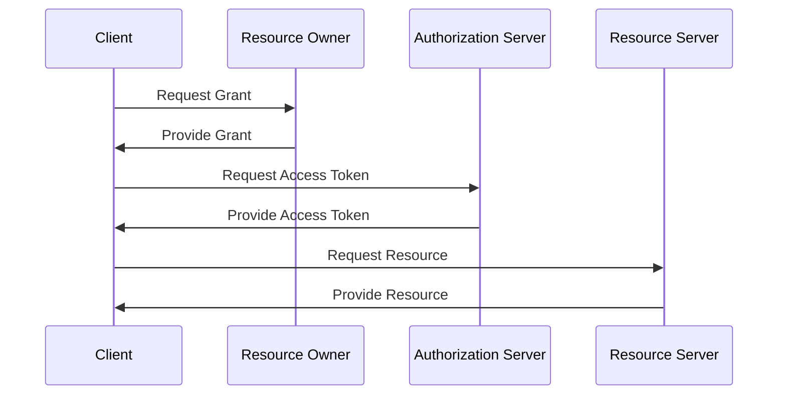
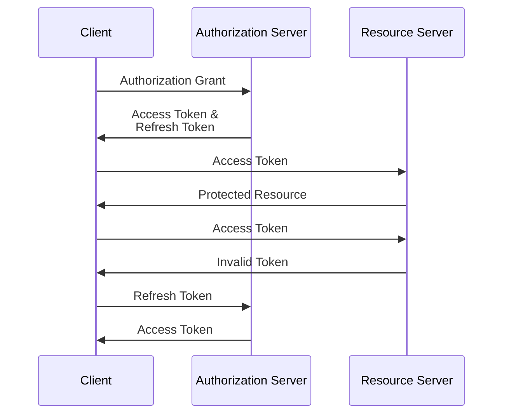

# OAuth 2.0

OAuth is an authorization framework defined in [RFC
6749](https://www.rfc-editor.org/rfc/rfc6749). It allows users to give
authorization to a web applications to access their resources hosted in another
web service, without sharing their credentials with the web application. For
example: I can give Netlify authorization to access my GitHub repositories,
without giving Netlify my GitHub credentials.

## Some Terminology

The terminology (defined in the RFC itself) we use to explain OAuth is the
following:

- **Resource Owner:** is the user that owns the resource. In the example above,
  the resource owner is a GitHub end-user.

- **Resource Server:** is the server that stores the resources. In the example
  above, the resource server is GitHub.

- **Client:** is the application that is requesting access to the resources. In
  the example above, the client is Netlify.

- **Authorization Server:** is the server that issues access tokens, so the
  client can access the resources in the resource server. In the example above,
  the authorization server is also GitHub.

## The Overall Strategy

The overall framework for a resource owner to give authorization to a client to
access their resources is the following:

First, the client (e.g. Netlify) requests the resource owner (e.g. the GitHub
end-user) to give it authorization to access their resources. The resource
owner gives the authorization in the form of an _Authorization Grant_. The
Authorization Grand can, for example, a code that represents the resource
owner's consent.

Even though it's the resource owner that's supposed to give the client an
authorization grant, usually this happens in a roundabout way through the
authorization server as an intermediary: the client redirects the resource
owner to the authorization server, the resource owner grants the authorization,
the authorization server gives the authentication code to the client.

Then, the client contacts the authorization server to request an Access Token.
The client sends the Authorization Grant with the request to show the resource
owner's consent. The authorization server verifies the Authorization Grant, and
if it's valid, gives back an Access Token to the client.

Finally, the client contacts the resource server to request a resource. The
client sends the Access Token with the request to show it has the appropriate
permissions. The resource server verifies the Access Token, and if it's valid,
gives back the requested resource.

## Authorization Grant

There are several ways that OAuth allows for the Authorization Grant to be
provided to the client.

- **Authorization Code:** The client redirects the resource owner to the
  authorization server. The resource owner authenticates with the authorization
  server and gives permission for the client to access their resources. The
  authentication sever returns an authorization code to the client. The client
  follows the normal flow and uses the authorization code to get an access
  token.

- **Implicit:** The client never receives an authorization code. Rather, it
  receives an access token directly.

- **Resource Owner Password Credentials:** Instead of providing an
  authorization code, the resource owner provides their credentials to the
  client, and the client uses the credentials to get an access token.

- **Client Credentials:** Instead of providing an authorization code, or the
  resource owner's credentials, the client provides its own credentials to get
  the access token.

## Access Tokens and Refresh Tokens

- **Access Tokens:** are used to access protected resources in the resource sever.
  The client presents an access token to the resource server, and the resource
  server returns the requested resources to the client.

- **Refresh Tokens:** are used to get new access tokens. The client presents the
  refresh token to the authentication server, and the authentication server
  returns a new access token to the client.

Access tokens are generally short lived, but the client can always get a new
one with the refresh token. The usual flow goes something like this:

## Client Registration

Before a client can interact with an authentication server, the client must be
registered with the authentication server. The registration must include: the
type of the client, the redirection URIs, and optionally some additional
information, such as the application name, logo, etc.

The **Client Type** can be either _confidential_ or _public_. A confidential
client would be a web application with a back-end, that handles the interaction
with the authentication and the resource server in the back-end. In this
scenario, the resource owner doesn't have access to the tokens. A public client
would be a single page application that runs completely in the browser, and
that handles the interaction with the authentication and the resource server
completely in the front-end. In this scenario, the resource owner does have
access to the tokens.

The authorization server must issue a **Client Identifier**: a unique string
that identifies the client uniquely within the authentication server. The
client identifier is not secret.

## Client Password

When requesting a token, clients can use a Basic Authentication with a
password, or use the parameters `client_id` and `client_secret` in the body of
the request.

## Endpoints

There are typically 3 endpoints involved in the process: an authorization
endpoint, a token endpoint, and a redirection endpoint.

- **Authorization Endpoint:** is an endpoint of the Authentication Server, and
  it's where the resource owner gives permission for the client to access it's
  resources. If the permission is given, it's where the Authorization Grant is
  generated.

- **Token Endpoint:** is also an endpoint of the Authentication Server, and
  it's where, after getting the permission from the client, the client requests
  the tokens.

- **Redirection Endpoint:** is an endpoint of the Client, and it's where the
  Authorization Server will send the authorization codes and tokens.

# OAuth GitHub

1. Log in at GitHub.
2. Go to https://github.com/settings/apps
3. Click `New GitHub App`
